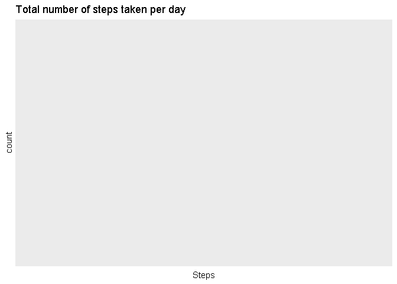
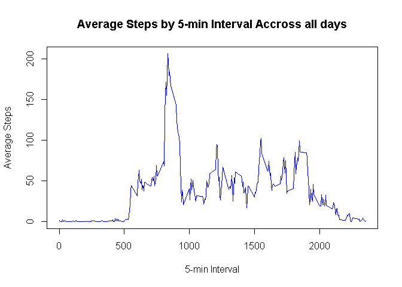
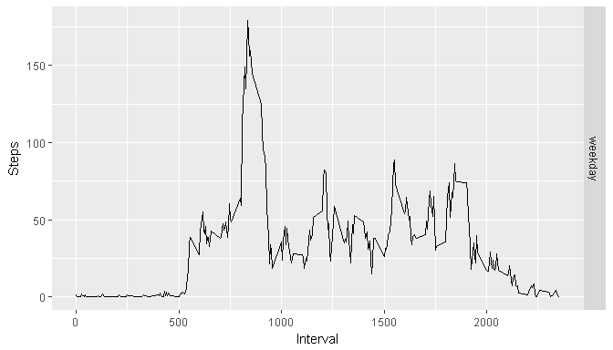

## Loading and preprocessing the data
1. Load the data:

```r
library(ggplot2)
```

```
## Warning: package 'ggplot2' was built under R version 3.4.2
```

```r
activity <- read.csv("activity.csv")
```
2. Process/transform the data into a format suitable for the analysis:

```r
activity$date <- as.Date(activity$date,"%Y %m %d")
cleanactivity <- activity[!is.na(activity$steps),]
```
## What is mean total number of steps taken per day?
1. Calculate the total number of steps taken per day:

```r
daysteps <- aggregate(cleanactivity$steps,by = list(cleanactivity$date), FUN = sum, na.rm = TRUE)
```
2. Make a histogram of the total number of steps taken each day:

```r
qplot(daysteps$x, xlab = "Steps", main = "Total number of steps taken per day")
```

```
## Don't know how to automatically pick scale for object of type list. Defaulting to continuous.
```

<!-- -->
3. Calculate and report the mean and median of the total number of steps taken per day

```r
# Calculate Statistics
mean  <- aggregate(cleanactivity$steps,by = list(cleanactivity$date), FUN = mean, na.rm = TRUE)
median<- aggregate(cleanactivity$steps,by = list(cleanactivity$date), FUN = median, na.rm = FALSE)
# Assign Names to Data Frames
names(mean) <- c("Date","Mean")
names(median) <- c("Date","Median")
stats <- merge(mean,median,by = "Date")

print(stats)
```

```
## [1] Date   Mean   Median
## <0 rows> (or 0-length row.names)
```

## What is the average daily activity pattern?
1. Make a time series plot of the 5-minute interval (x-axis) and the average number of steps taken, averaged across all days (y-axis)

```r
# Calculate Average Steps per 5-min interval
interval <- aggregate(cleanactivity$steps,by = list(cleanactivity$interval),FUN = mean)
# Assign Names to Data Frame
names(interval) <- c("Interval","Steps")
```

```r
plot(x = interval$Interval,y = interval$Steps, type = "l", col = "blue",
                                               xlab = "5-min Interval", ylab = "Average Steps",
                                               main = "Average Steps by 5-min Interval Accross all days")
```

<!-- -->
2. Which 5-minute interval, on average across all the days in the dataset, contains the maximum number of steps?

```r
max(aggregate(cleanactivity$steps,by = list(cleanactivity$interval),FUN = max))
```

```
## [1] 2355
```


## Imputing missing values
1. Calculate and report the total number of missing values in the dataset:

```r
sum(is.na(activity$steps))
```

```
## [1] 2304
```
2. Devise a strategy for filling in all of the missing values in the dataset:

Several strategies migth be implemented for this mission, to simplify I will just substitute NA values by
0's assuming that no steps were taken that specific day/interval due to different reasons. Other strategies can be:

- Substituting by random value with normal distribution of corresponding 5-min interval.
- Substituting by random value with normal distribution of corresponding day.
- Substituting by mean value of corresponding 5-min interval.
- Substituting by mean value of corresponding day.
- ...

3. Create a new dataset that is equal to the original dataset but with the missing data filled in

```r
fillactivity <- activity
fillactivity$steps[is.na(activity$steps)] <- 0
```
4. Make a histogram of the total number of steps taken each day:

```r
# Calculate Total Number of Steps
daysteps2 <- aggregate(fillactivity$steps,by = list(fillactivity$date), FUN = sum, na.rm = TRUE)
# Plot Histogram of Total number of Steps
qplot(daysteps2$x, xlab = "Steps", main = "Total number of steps taken per day")
```

```
## Don't know how to automatically pick scale for object of type list. Defaulting to continuous.
```

<!-- -->
5. Calculate and report the mean and median total number of steps taken per day:

```r
# Calculate Statistics
mean2  <- aggregate(fillactivity$steps,by = list(fillactivity$date), FUN = mean, na.rm = TRUE)
median2<- aggregate(fillactivity$steps,by = list(fillactivity$date), FUN = median, na.rm = FALSE)
# Assign Names to Data Frames
names(mean2) <- c("Date","Mean")
names(median2) <- c("Date","Median")
stats2 <- merge(mean2,median2,by = "Date")

print(stats2)
```

```
## [1] Date   Mean   Median
## <0 rows> (or 0-length row.names)
```
6. Do these values differ from the estimates from the first part of the assignment? What is the impact of imputing missing data on the estimates of the total daily number of steps?

```r
# Merge both Data Frames by Date
diff_mean <- merge(mean,mean2,by="Date")
diff_median <- merge(median,median2,by="Date")

print(diff_mean)
```

```
## [1] Date   Mean.x Mean.y
## <0 rows> (or 0-length row.names)
```

```r
print(diff_median)
```

```
## [1] Date     Median.x Median.y
## <0 rows> (or 0-length row.names)
```
As we can see from the output there is no difference by substitutting NA values.

## Are there differences in activity patterns between weekdays and weekends?
1. Create a new factor variable in the dataset with two levels - "weekday" and "weekend" indicating whether a given date is a weekday or weekend day:

```r
fillactivity$day <- ifelse(weekdays(as.Date(fillactivity$date,"%Y %m %d"))%in%c("sabado","domingo"),
                           "weekend","weekday")
```
2. Make a panel plot containing a time series plot (i.e. type = "l") of the 5-minute interval (x-axis) and the average number of steps taken, averaged across all weekday days or weekend days (y-axis):

```r
# Calculate Average Steps per 5-min Interval:
avgactivity <- aggregate(fillactivity$steps, by = list(fillactivity$interval, fillactivity$day), FUN = mean)
# Assign Names to Vector
names(avgactivity)<-c("Interval","Day","Steps")
# Plot Average Steps per 5-min Interval
g<-ggplot(data = avgactivity,aes(Interval,Steps))
g + geom_line() + facet_grid(avgactivity$Day~.)
```

<!-- -->
